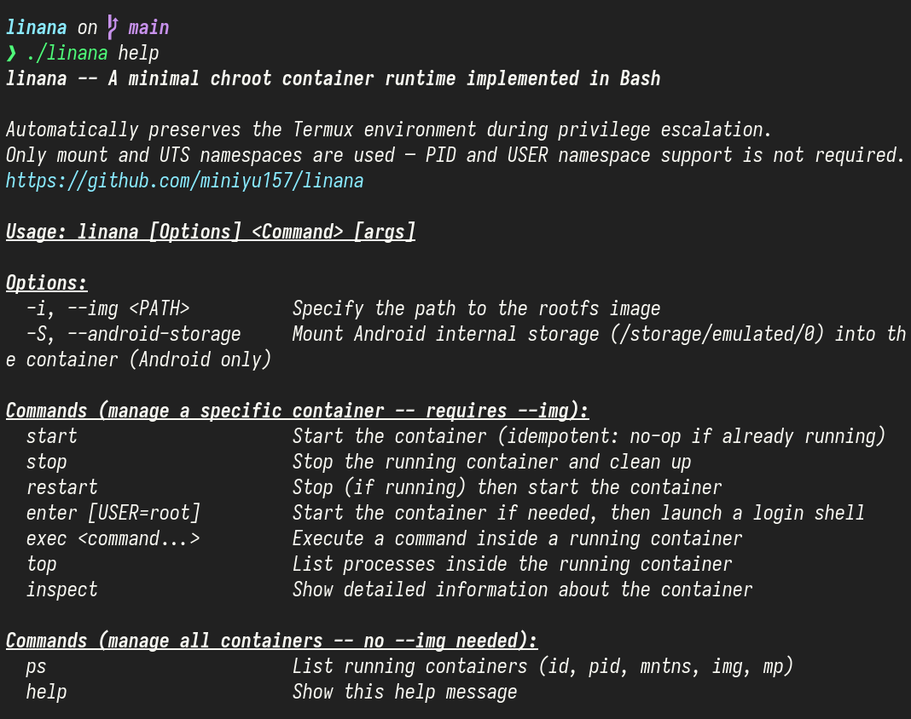

# linana

> 一个小于 250LOC 的 Bash 程序，完整实现了
> `start / stop / restart / enter / exec / top / inspect / ps / help`
> 九个子命令，覆盖了容器的完整生命周期管理。
>
> 零依赖。仅使用 Linux 内核的 mount 和 UTS 命名空间。

[](./LICENSE)



> `> rg -cv '^\s*(#|$)' linana`  
> `223`

---

## 🐱 这是什么

linana 是我的 Bash 毕业作，一个最小化的纯 Bash 容器运行时。

~~也可以叫李娜娜（划掉）~~

它的极简并非来自对功能的粗暴阉割，而是建立在最纯粹的抽象之上。这是一个反直觉的实验：**用 Bash 证明，系统工程的复杂度不在于语言，而在于思维模型。**

**与 ruri/Droidspaces/Docker 的区别：**

linana 不是这些神作的替代品。它是当你在 Android 这样受限的环境中，不想重新编译内核，不想额外部署 Daemon，只想快速拉起一个纯净的 chroot 环境时，linana 是一个给力的好帮手。

- **纯粹 Runtime**: 只对已有的 rootfs 镜像进行操作。
- **兼容性极高**：仅使用 `mount` + `UTS` 命名空间，避开受限内核的限制。
- **Android 原生适配**：自动处理 su 提权与 Termux 环境继承，支持挂载 `/storage`。
- **内容寻址**：使用 rootfs IMG 路径的 Hash 作为容器唯一标识，实现无状态管理。

## 🧬 为什么只有 240 LOC？

linana 并不是一个容器“平台”，它将自己严格限定为一个 **Runtime**。240 行代码不是刻意压缩的目标，而是边界裁剪后的自然结果：

- **无后台 Daemon**：不驻留任何守护进程，命令即发即弃。
- **Linux 即状态中心**：不使用文件或数据库保存容器状态。Namespace 的存活就是容器的生命周期；系统的 mount 树就是容器的挂载状态。linana 不“记录”状态，它直接向内核“查询”状态。
- **最小特权正交组合**：除挂载与隔离外的所有复杂性，全部交还给宿主机系统。

当本不属于 Runtime 的复杂度被剥离后，剩下的就是纯粹的系统调用映射。

## ⚙️ 容器状态机模型

所有的九个子命令，全部基于以下这个极简的内核状态机模型推演而来：

```plaintext
    unshare -m -u sleep infinity    通过命令行参数指定 IMGPATH
           ↓                                 ↓
      得到主进程 PID                  sha256(IMGPATH) 取前 8 位 hash
           ↓                                 ↓
           │                   ┌─ 状态锚点: /tmp/lina_<hash>.pid
           │                   └─ 挂载锚点: /mnt/lina/<hash>
           │                                 ↓
           │                   mount $IMG → /mnt/lina/<hash>
           ↓                                 ↓
    nsenter 进入命名空间 ────────────────────┘
           ↓
    bind mount: /dev /dev/pts /proc /sys
    tmpfs:      /tmp /run
    (可选 Android: rbind /storage/emulated/0)
           ↓
    chroot /mnt/lina/<hash> → 容器就绪

    --------------------------------------------------------------
    enter/exec : nsenter → chroot → /bin/su - ... / -c ...
    top        : 遍历 /proc，直接按 mntns inode 过滤进程
    ps         : 遍历 /tmp/lina_*.pid，校验存活状态 → 列出所有容器
    stop       : kill 命名空间内所有进程 → kill sleep → umount
```

## 😺 快速开始

假设你已经准备好了一个 ext4 rootfs 镜像文件 `image.img`

```bash
# 1) 只准备好容器，使其在后台保持 mntns PID 和挂载状态，不进入终端或运行命令
linana -i image.img start

# 2) 进入容器终端（若容器未运行，自动启动；默认用户为 root）
linana -i image.img enter

# 3) 进入容器终端，指定登录用户
linana -i image.img enter <user>

# 4) 在已运行的容器中直接执行命令
linana -i image.img exec uname -a

# 5) 连带 Android 存储一并挂载进容器（restart/enter 均会运行完整的容器启动逻辑）
linana -S -i image.img start

# 6) 列出容器内所有进程
linana -i image.img top

# 7) 查看容器的详细运行状态（是否启动、PID、mntns、挂载点等）
linana -i image.img inspect

# 8) 列出所有运行中的容器
linana ps

# 9) 重启容器（先 stop 再 start）
linana -i image.img restart

# 10) 停止容器并清理所有相关资源（进程、挂载点、pid 文件等）
linana -i image.img stop

# 11) 显示完整帮助信息
linana help
```

## 🐰 Termux / Android

在 Termux 里会自动提权，保留 Termux 环境变量。  
依赖 su --mount-master，在标准 Linux 环境时提示使用 sudo。

可选参数 `--android-storage` 会把 `/storage/emulated/0` 以 rbind 方式暴露进容器。

## 🦉 其它

使用 `shfmt -i 4 -ci -sr -s -d` 格式化，保持较高可读性。

## ⚖️ LICENSE

[MIT](./LICENSE)
